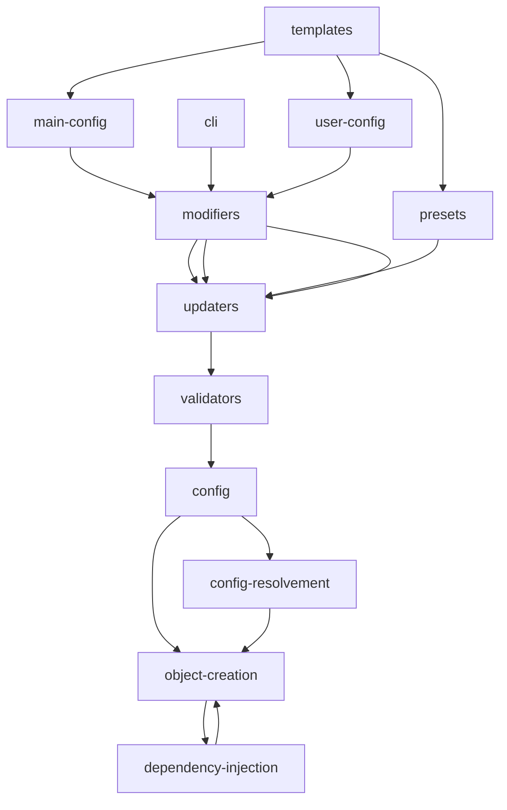

# Overview

1. templates: inserted into config
2. modifiers: changing raw values 
3. validators: checking raw values
4. object creation, resolvers and dependency injection

```mermaid
graph TD;
    main-config-->modifiers-->updaters
    cli-->modifiers-->updaters
    presets-->updaters
    templates-->main-config
    templates-->presets
    templates-->user-config
    user-config-->modifiers-->updaters-->validators;
    validators-->config
    config-->object-creation
    config-->config-resolvement

    dependency-injection-->object-creation
    object-creation-->dependency-injection
    config-resolvement-->object-creation

```

